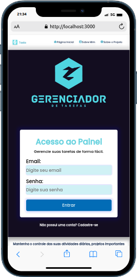
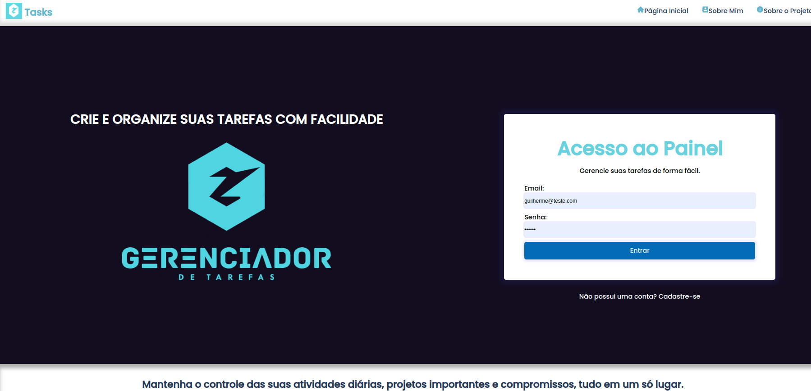

# Sobre o projeto
Meu projeto é uma aplicação web desenvolvida com Next.js que tem como objetivo facilitar o gerenciamento de tarefas de forma fácil e eficiente. Criei a aplicação com páginas para autenticação de usuários, onde os usuários podem fazer login usando seu email e senha. Além disso, implementei o recurso de cadastro (signup) para novos usuários.
Funcionalidades do Projeto:
Login: Permite que os usuários autentiquem-se na aplicação usando email e senha.
Cadastro (Signup): Implementação de cadastro para novos usuários, que são armazenados na API personalizada criada com Node.js.
Gerenciamento de Tarefas: Os usuários podem criar, editar e excluir suas tarefas, com todas as alterações sendo salvas no banco de dados.

Após autenticar-se, os usuários são redirecionados para a página de gerenciamento de tarefas. Lá, eles podem criar novas tarefas, editar tarefas existentes e excluir tarefas concluídas. Todas as operações realizadas são enviadas à API, garantindo que as tarefas permaneçam atualizadas e acessíveis em futuros acessos à aplicação.

Todo o projeto é baseado em uma API personalizada que criei usando Node.js, responsável por armazenar todas as informações no banco de dados. Na página de gerenciamento de tarefas, os usuários podem criar, editar e excluir suas tarefas, e todas as alterações são refletidas no banco de dados, garantindo a persistência e integridade dos dados.

## Layout mobile

## Layout web

# Tecnologias utilizadas
### Next.js:
Framework React para construção de aplicações web.
### React:
Biblioteca JavaScript para criação de interfaces de usuário.
### CSS Modules:
Método de estilização em que as classes CSS são escopadas localmente em componentes React.
### Node.js: 
Plataforma JavaScript usada para desenvolvimento do servidor e da API personalizada.

# Autor
Guilherme Gomes
https://www.linkedin.com/in/guilherme-gomes-427321238/
